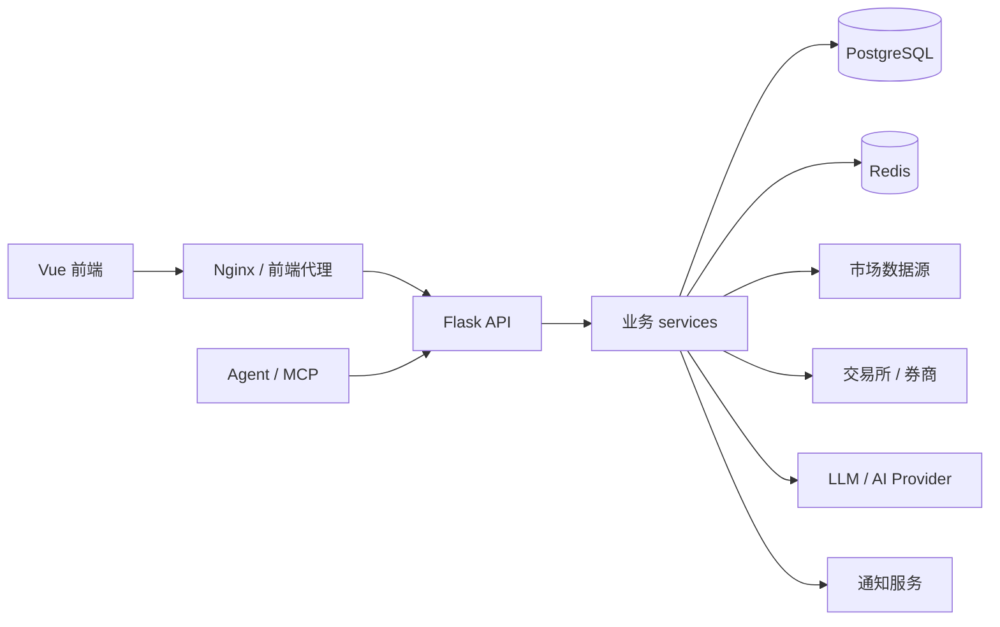

# QuantDinger 项目模块维护导览

本文用于给后续维护者快速建立项目全貌：每个目录负责什么、主要业务模块在哪里、接口和前端页面如何对应，以及改功能时应该优先看哪些文件。

## 1. 工作区概览

当前工作区 `C:\Users\ASUS\Desktop\code\A` 下主要有三类内容：

| 路径 | 类型 | 说明 |
| --- | --- | --- |
| `QuantDinger/` | 主仓库 | 后端 Flask API、Docker Compose、数据库迁移、产品文档、MCP 服务。 |
| `QuantDinger-Vue/` | 前端仓库 | Vue 2 + Vite 单页应用源码，负责 Web UI、路由、状态管理和 API 调用。 |
| `byte-lantern-pet-run/` | 生成素材产物 | 包含图片、帧、spritesheet 和 QA 文件，不属于 QuantDinger 主业务系统。 |

> 维护业务功能时，通常需要同时查看 `QuantDinger/backend_api_python` 和 `QuantDinger-Vue/src`。部署、环境变量、数据库和 MCP 相关内容主要在 `QuantDinger` 主仓库。

## 2. 产品功能总览

QuantDinger 是一个自托管量化交易工作台，核心能力包括：

- AI 市场研究和资产分析：行情概览、新闻、情绪、机会雷达、AI 报告、分析记忆和反馈。
- 指标与策略开发：浏览器内编写 Python 指标/策略，支持参数解析、代码校验、AI 生成和质量提示。
- 回测与复盘：服务端回测、交易明细、权益曲线、历史回测、AI 回测分析。
- 实盘与模拟交易：策略运行、快速下单、待处理订单、执行日志、持仓同步和通知。
- 多市场数据：Crypto、USStock、CNStock、HKStock、Forex、Futures、MOEX 等市场数据源。
- 券商和交易所接入：Binance、OKX、Bitget、Bybit、Coinbase、Kraken、KuCoin、Gate、Deepcoin、HTX、IBKR、MT5、Alpaca。
- 组合和监控：手动持仓、组合汇总、监控规则、告警和分组。
- 平台运营：登录注册、OAuth、用户管理、角色权限、积分、会员、USDT 支付、系统设置。
- Agent Gateway 和 MCP：通过 `/api/agent/v1` 向 AI Agent 暴露受控能力，MCP 服务将其包装成工具。

## 3. 后端模块

后端位于 `QuantDinger/backend_api_python`，技术栈是 Flask + PostgreSQL + Redis。入口是 `run.py` 和 `app/__init__.py`，应用采用 app factory 创建，并在启动时注册路由、初始化数据库、启动后台 worker。

### 3.1 后端目录

| 路径 | 作用 |
| --- | --- |
| `app/__init__.py` | Flask 应用工厂、JSON 序列化、CORS、数据库初始化、后台任务启动、恢复运行中策略。 |
| `app/routes/` | Flask Blueprint 接口层，负责 HTTP 参数、鉴权和调用 service。 |
| `app/services/` | 业务逻辑层，覆盖 AI、策略、回测、交易、计费、用户、通知等。 |
| `app/services/live_trading/` | 实盘交易所和券商 REST 客户端工厂及具体适配器。 |
| `app/services/experiment/` | 策略实验、行情 regime 检测、优化器和评分逻辑。 |
| `app/services/usdt_payment/` | USDT 支付链路、订单服务和链上 watcher。 |
| `app/services/paper_trading/` | 纸面交易逻辑，例如 A 股模拟策略。 |
| `app/data_sources/` | K 线和报价数据源，按市场类型分发。 |
| `app/data_providers/` | 全球市场页数据提供方，例如新闻、热力图、情绪、机会。 |
| `app/utils/` | DB、鉴权、缓存、日志、时间、配置、凭证加密、安全执行等工具。 |
| `app/config/` | 环境变量、数据库、API key、数据源等配置。 |
| `migrations/init.sql` | PostgreSQL 初始化 schema 和索引。 |
| `tests/` | 后端 pytest 测试。 |
| `scripts/` | 辅助脚本，例如模拟执行、校验数据源、回填数据。 |

### 3.2 后端接口模块

路由统一在 `app/routes/__init__.py` 注册：

| Blueprint | 前缀 | 功能 |
| --- | --- | --- |
| `health` | `/`, `/health`, `/api/health` | 健康检查。 |
| `auth` | `/api/auth` | 登录、2FA、验证码、注册、重置密码、OAuth、当前用户信息。 |
| `user` | `/api/users` | 用户管理、资料、积分、VIP、通知设置、图表模板、后台订单和统计。 |
| `market` | `/api/market` | 市场配置、品种搜索、热门品种、自选列表、价格。 |
| `global_market` | `/api/global-market` | 全球市场概览、热力图、新闻、经济日历、情绪、机会雷达。 |
| `indicator` | `/api/indicator` | 指标列表、保存/删除、参数解析、代码验证、AI 生成、指标调用。 |
| `backtest` | `/api/indicator` | 指标回测、回测历史、回测详情、AI 回测分析。 |
| `strategy` | `/api` | 策略模板、策略 CRUD、批量启动/停止、回测、运行、日志、通知、性能。 |
| `quick_trade` | `/api/quick-trade` | 快速下单、余额、持仓、平仓、历史。 |
| `portfolio` | `/api/portfolio` | 手动持仓、组合汇总、监控器、告警、分组。 |
| `credentials` | `/api/credentials` | 交易所/券商凭证列表、创建、读取、删除、出站 IP。 |
| `ibkr` | `/api/ibkr` | IBKR 连接、账户、持仓、订单、报价。 |
| `alpaca` | `/api/alpaca` | Alpaca 连接、账户、持仓、订单、报价。 |
| `mt5` | `/api/mt5` | MT5 连接、账户、持仓、订单、品种、报价。 |
| `fast_analysis` | `/api/fast-analysis` | AI 快速分析、历史、反馈、表现、相似模式。 |
| `ai_chat` | `/api/ai` | AI 聊天消息和历史。 |
| `community` | `/api/community` | 指标社区、购买、同步、评论、作者面板、后台审核。 |
| `billing` | `/api/billing` | 会员套餐、购买、USDT 链、USDT 订单。 |
| `settings` | `/api/settings` | 配置 schema、公开配置、品牌配置、保存配置、连接测试。 |
| `policy` | `/api/policy` | 券商市场策略。 |
| `experiment` | `/api/experiment` | regime 检测、实验 pipeline、AI 优化、结构化调参。 |
| `cn_stock_screener` | `/api/cn-stock-screener` | A 股筛选和批量创建纸面策略。 |
| `agent_v1` | `/api/agent/v1` | 面向 AI Agent 的受控市场、策略、回测、组合、任务和 token 管理接口。 |

### 3.3 核心 service 维护入口

| 业务域 | 重点文件 |
| --- | --- |
| AI 分析 | `services/fast_analysis.py`, `services/analysis_memory.py`, `services/llm.py`, `services/ai_calibration.py`, `services/reflection.py` |
| 指标与代码 | `services/builtin_indicators.py`, `services/indicator_params.py`, `services/indicator_translator.py`, `services/indicator_code_quality.py`, `utils/safe_exec.py` |
| 回测 | `services/backtest.py`, `routes/backtest.py`, `migrations/init.sql` 中 `qd_backtest_*` 表 |
| 策略生命周期 | `services/strategy.py`, `services/strategy_lifecycle.py`, `services/strategy_compiler.py`, `services/strategy_script_runtime.py`, `services/trading_executor.py` |
| 实盘执行 | `services/exchange_execution.py`, `services/pending_order_worker.py`, `services/live_trading/` |
| 券商账户 | `services/ibkr_trading/`, `services/mt5_trading/`, `services/alpaca_trading/`, `utils/broker_session.py` |
| 市场数据 | `data_sources/factory.py`, `data_sources/*.py`, `data_providers/*.py`, `services/kline.py`, `services/market_data_collector.py` |
| 组合监控 | `routes/portfolio.py`, `services/portfolio_monitor.py`, `services/capital_pool.py` |
| 用户和权限 | `routes/auth.py`, `routes/user.py`, `services/user_service.py`, `services/security_service.py`, `utils/auth.py` |
| 计费和支付 | `services/billing_service.py`, `services/usdt_payment_service.py`, `services/usdt_payment/` |
| Agent Gateway | `routes/agent_v1/`, `utils/agent_auth.py`, `utils/agent_jobs.py`, `docs/agent/` |

### 3.4 后台任务和启动行为

`app/__init__.py` 在创建应用后会执行这些启动逻辑：

- 初始化数据库并确保管理员账号存在。
- 启动 `PendingOrderWorker`，默认由 `ENABLE_PENDING_ORDER_WORKER` 控制。
- 启动组合监控服务，由 `ENABLE_PORTFOLIO_MONITOR` 控制。
- 启动 USDT 订单 worker，由 `USDT_PAY_ENABLED` 控制。
- 启动 AI 校准和 reflection worker。
- 恢复数据库中处于 running 状态的策略，可通过 `DISABLE_RESTORE_RUNNING_STRATEGIES=true` 关闭。

维护这类逻辑时要注意 Flask debug reloader 可能导致重复启动，代码中已经用 `WERKZEUG_RUN_MAIN` 做了规避。

### 3.5 数据库主表

数据库初始化在 `backend_api_python/migrations/init.sql`，核心表可以按业务域理解：

| 业务域 | 表 |
| --- | --- |
| 用户/安全 | `qd_users`, `qd_oauth_states`, `qd_verification_codes`, `qd_login_attempts`, `qd_oauth_links`, `qd_security_logs` |
| 计费/积分 | `qd_credits_log`, `qd_membership_orders`, `qd_usdt_orders` |
| 策略/交易 | `qd_strategies_trading`, `qd_strategy_positions`, `qd_strategy_trades`, `pending_orders`, `qd_strategy_notifications`, `qd_strategy_logs`, `qd_strategy_execution_events` |
| 指标/回测 | `qd_indicator_codes`, `qd_backtest_runs`, `qd_backtest_trades`, `qd_backtest_equity_points` |
| 市场/自选 | `qd_market_symbols`, `qd_watchlist` |
| AI 分析 | `qd_analysis_tasks`, `qd_analysis_memory` |
| 凭证/组合 | `qd_exchange_credentials`, `qd_manual_positions`, `qd_position_alerts`, `qd_position_monitors` |
| 社区 | `qd_indicator_purchases`, `qd_indicator_comments` |
| 快速交易 | `qd_quick_trades` |
| Agent | `qd_agent_tokens`, `qd_agent_jobs`, `qd_agent_audit`, `qd_agent_paper_orders` |

## 4. 前端模块

前端位于 `QuantDinger-Vue`，技术栈是 Vue 2.7、Vue Router、Vuex、Ant Design Vue、Axios、ECharts、KLineCharts、CodeMirror、Pyodide。构建工具是 Vite，包管理器是 pnpm。

### 4.1 前端目录

| 路径 | 作用 |
| --- | --- |
| `src/main.js` | 前端入口。 |
| `src/App.vue` | 根组件。 |
| `src/config/router.config.js` | 主路由和菜单配置。 |
| `src/permission.js` | 路由守卫、token 检查、动态路由生成。 |
| `src/api/` | 按业务拆分的 API 调用封装。 |
| `src/views/` | 页面级模块。 |
| `src/components/` | 通用组件，例如图表、全局头部、快速交易面板、券商账户弹窗等。 |
| `src/store/` | Vuex 模块，包含用户、路由、品牌、策略策略等状态。 |
| `src/utils/request.js` | Axios 实例、请求/响应拦截、token 注入、语言头、超时策略。 |
| `src/locales/lang/` | 多语言资源。 |
| `src/services/pyodide/` | 浏览器内 Python/Pyodide 服务。 |
| `deploy/` | Nginx/Caddy 部署配置。 |

### 4.2 页面路由和功能

主要路由在 `src/config/router.config.js`：

| 路由 | 页面目录 | 功能 |
| --- | --- | --- |
| `/ai-asset-analysis` | `views/ai-asset-analysis` | 首页，AI 资产分析、全球市场数据、机会/情绪等。 |
| `/indicator-community` | `views/indicator-community` | 指标社区、购买、评论、作者/审核相关界面。 |
| `/indicator-ide` | `views/indicator-ide` | 指标 IDE，集成图表、代码编辑、参数、回测和 AI 生成。 |
| `/cn-stock-screener` | `views/cn-stock-screener` | A 股筛选和创建纸面策略。 |
| `/strategy-live` | `views/trading-assistant` | 指标信号策略管理、实盘/模拟运行、记录、日志和绩效。 |
| `/strategy-script` | `views/trading-assistant` | Python 脚本策略深链入口，默认隐藏。 |
| `/trading-bot` | `views/trading-bot` | 交易机器人工作台，包含创建向导、机器人详情、模板配置。 |
| `/broker-accounts` | `views/broker-accounts` | IBKR、MT5、Alpaca 等统一账户连接、持仓和挂单。 |
| `/ai-analysis/:pageNo?` | `views/ai-analysis` | 旧 AI 分析页，隐藏路由。 |
| `/portfolio` | `views/portfolio` | 组合和持仓监控，隐藏路由。 |
| `/profile` | `views/profile` | 个人中心。 |
| `/billing` | `views/billing` | 会员、积分和充值。 |
| `/user-manage` | `views/user-manage` | 管理员用户管理。 |
| `/agent-tokens` | `views/agent-tokens` | 管理员签发/撤销 Agent Token，查看审计。 |
| `/settings` | `views/settings` | 管理员系统设置。 |
| `/user/login` | `views/user/Login.vue` | 登录页。 |

### 4.3 API 调用文件

| 文件 | 对应后端 |
| --- | --- |
| `api/auth.js`, `api/login.js`, `api/user.js` | `/api/auth`, `/api/users` |
| `api/market.js`, `api/global-market.js` | `/api/market`, `/api/global-market` |
| `api/fast-analysis.js` | `/api/fast-analysis` |
| `api/strategy.js`, `api/ai-trading.js` | `/api/strategies`, `/api/templates` 等策略接口 |
| `api/quick-trade.js` | `/api/quick-trade` |
| `api/portfolio.js` | `/api/portfolio` |
| `api/credentials.js`, `api/broker.js` | `/api/credentials`, `/api/ibkr`, `/api/mt5`, `/api/alpaca` |
| `api/billing.js` | `/api/billing` |
| `api/settings.js`, `api/brand.js`, `api/policy.js` | `/api/settings`, `/api/policy` |
| `api/agent.js` | `/api/agent/v1` |
| `api/cn-stock-screener.js` | `/api/cn-stock-screener` |

请求层统一在 `src/utils/request.js`，会自动附加 `Authorization: Bearer <token>`、`Access-Token`、`token`、`X-App-Lang`、`Accept-Language`，并对 AI 分析、AI 生成、回测设置更长超时。

## 5. 部署与运行模块

主仓库提供 Docker Compose 一键栈：

| 服务 | 默认端口 | 说明 |
| --- | --- | --- |
| `postgres` | `127.0.0.1:5432` | PostgreSQL 16，挂载 `migrations/init.sql` 初始化。 |
| `redis` | `127.0.0.1:6379` | Redis 7，缓存和 worker 辅助。 |
| `backend` | `127.0.0.1:5000` | Flask/Gunicorn API，从 `backend_api_python` 构建。 |
| `frontend` | `8888` | Nginx 托管前端 SPA，默认拉取 GHCR 镜像。 |

关键文件：

- `docker-compose.yml`：本地后端构建 + 前端 GHCR 镜像。
- `docker-compose.ghcr.yml`：后端和前端都使用 GHCR 镜像。
- `docker-compose.build.yml`：本地构建前端源码时叠加使用。
- `backend_api_python/env.example`：后端主环境变量模板。
- `backend_api_python/Dockerfile`：后端镜像构建。
- `QuantDinger-Vue/Dockerfile`：前端镜像构建。

常见命令：

```bash
cp backend_api_python/env.example backend_api_python/.env
docker compose up -d
docker compose logs -f backend
docker compose restart backend
docker compose up -d --build backend
```

## 6. MCP 与 Agent 模块

QuantDinger 提供两层 Agent 能力：

1. 后端 REST：`/api/agent/v1`
   - 位置：`backend_api_python/app/routes/agent_v1/`
   - 功能：市场查询、K 线、价格、策略读写、回测、实验、任务、组合、快速交易、token 管理和审计。
   - 鉴权：`utils/agent_auth.py`，使用后台签发的 Agent Token。

2. MCP 服务：`mcp_server/`
   - 作用：把 Agent Gateway 的部分能力包装成 MCP tools。
   - 默认只暴露读取类和回测类工具，不暴露 MCP 实盘交易。
   - 入口配置依赖 `QUANTDINGER_BASE_URL` 和 `QUANTDINGER_AGENT_TOKEN`。

维护 Agent 能力时，优先保证 REST 网关是事实源，再同步 MCP server 工具定义和 `docs/agent/agent-openapi.json`。

## 7. 横向依赖关系



关键维护原则：

- 前端页面只做交互和展示，核心业务判断尽量放在后端 service。
- 新接口先放入对应 `routes/<domain>.py`，业务逻辑放入 `services/<domain>.py`。
- 涉及市场数据优先走 `DataSourceFactory`，不要在业务模块里直接硬编码数据源。
- 涉及实盘交易优先走 `live_trading/factory.py` 和对应 client，保持 broker/exchange 适配隔离。
- 涉及数据库字段变更时，同时更新 `migrations/init.sql`、相关 service、测试和文档。

## 8. 常见维护场景

### 新增一个后端接口

1. 在 `app/routes/<domain>.py` 增加 route。
2. 在 `app/services/<domain>.py` 或合适 service 中实现业务逻辑。
3. 如需鉴权，复用 `utils/auth.py` 或 Agent 场景下的 `utils/agent_auth.py`。
4. 前端在 `src/api/<domain>.js` 增加调用方法。
5. 页面在 `src/views/<domain>/` 消费 API。
6. 为关键逻辑补充 `backend_api_python/tests/` 测试。

### 新增一个市场数据源

1. 在 `app/data_sources/<name>.py` 实现数据源类。
2. 在 `app/data_sources/factory.py` 注册市场类型或别名。
3. 若影响全球市场页，同步 `app/data_providers/`。
4. 增加数据源测试，重点覆盖 symbol、timeframe、异常和空数据。

### 新增一个交易所或券商

1. 在 `app/services/live_trading/<exchange>.py` 实现 client。
2. 在 `app/services/live_trading/factory.py` 注册 `exchange_id`。
3. 如有独立账户页能力，补充 `routes/<broker>.py` 和前端 `views/broker-accounts`。
4. 凭证结构同步 `routes/credentials.py`、前端 `api/credentials.js` 和相关表单。
5. 增加连接测试和下单/撤单路径测试。

### 新增一个前端页面

1. 在 `src/views/<feature>/` 创建页面。
2. 在 `src/config/router.config.js` 增加路由和权限。
3. 在 `src/api/` 增加 API 封装。
4. 如需要全局状态，补充 `src/store/modules/`。
5. 补齐 `src/locales/lang/*.js` 中的菜单和页面文案。

### 修改登录/权限

重点查看：

- 后端：`routes/auth.py`, `routes/user.py`, `utils/auth.py`, `services/security_service.py`
- 前端：`src/permission.js`, `src/store/modules/user.js`, `src/store/modules/async-router.js`, `src/utils/request.js`
- 数据库：`qd_users`, `qd_login_attempts`, `qd_security_logs`, `qd_oauth_*`

### 修改 AI 分析

重点查看：

- 后端：`routes/fast_analysis.py`, `services/fast_analysis.py`, `services/llm.py`, `services/analysis_memory.py`
- 前端：`views/ai-asset-analysis`, `views/ai-analysis`, `api/fast-analysis.js`
- 数据库：`qd_analysis_memory`, `qd_analysis_tasks`

### 修改策略运行

重点查看：

- 后端：`routes/strategy.py`, `services/strategy.py`, `services/trading_executor.py`, `services/strategy_lifecycle.py`, `services/strategy_script_runtime.py`
- 前端：`views/trading-assistant`, `views/trading-bot`, `api/strategy.js`
- 数据库：`qd_strategies_trading`, `qd_strategy_positions`, `qd_strategy_trades`, `pending_orders`, `qd_strategy_logs`, `qd_strategy_execution_events`

### 修改 A 股筛选和纸面策略

重点查看：

- 前端：`QuantDinger-Vue/src/views/cn-stock-screener/index.vue`, `QuantDinger-Vue/src/api/cn-stock-screener.js`
- 后端接口和创建：`routes/cn_stock_screener.py`, `services/cn_stock_screener.py`, `services/strategy.py`
- 运行和成交：`services/trading_executor.py`, `services/paper_trading/cn_stock.py`
- 测试：`tests/test_cn_stock_screener.py`, `tests/test_cn_stock_paper_trading.py`

A 股筛选页批量创建的是 `CNStock` + `paper` + `spot` + `long` 的指标策略。默认使用自动买入比例，不向每只股票强制写入统一的 `entry_pct` / `position_pct`；如果用户关闭自动模式并填写默认买入比例，或单只股票条目携带自己的 `entry_pct` / `position_pct`，创建时才会写入固定比例。`max_position_pct` 是该策略分配资金内的最大持仓百分比。执行层始终按剩余分配资金、最大仓位和市场规则限制订单，A 股纸面成交规则在 `paper_trading/cn_stock.py` 统一处理，买入会按 100 股一手向下取整，不足 100 股会拒绝成交。

A 股筛选接口 `/api/cn-stock-screener/run` 采用异步任务模式：提交后立即返回 `job_id`，前端通过 `/api/cn-stock-screener/jobs/<job_id>` 轮询任务状态、进度和最终结果。任务后台执行规则评分、可选增强数据和 FastAnalysis AI 分析；`candidate_limit`、`ai_top_n` 和 `enrichment_top_n` 仍按服务端上限约束，`sync_ai=false` 时只做规则筛选。

## 9. 测试与验证

后端测试：

```bash
cd QuantDinger/backend_api_python
pytest tests/ -v
```

前端常用检查：

```bash
cd QuantDinger-Vue
pnpm install
pnpm run lint:nofix
pnpm run build
```

本地联调：

```bash
cd QuantDinger
docker compose up -d
```

访问：

- Web UI：`http://localhost:8888`
- API health：`http://localhost:5000/api/health`
- 默认账号通常为：`quantdinger / 123456`，生产环境必须修改。

## 10. 维护注意事项

- `README.md` 和部分中文注释存在编码显示异常，判断功能时优先看实际代码、路由注册和测试。
- 前端开发端口通常是 `8000`，Docker 前端端口是 `8888`，后端 API 是 `5000`。
- `SECRET_KEY`、交易所 key、OAuth key、LLM key 都应只放在 `.env`，不要提交。
- 实盘交易相关改动风险高，必须区分 paper/demo/testnet/live，并确认 `AGENT_LIVE_TRADING_ENABLED`、`paper_only` 等开关。
- IBKR 和 MT5 依赖本地桌面/终端环境，云部署时通常应通过 `ALLOW_LOCAL_DESKTOP_BROKERS` 控制。
- Agent Gateway 调用会审计，新增 Agent 能力时要考虑 scope、allowlist、rate limit 和 paper-only 保护。
- 新增语言文案时要同步 `src/locales/lang/` 下所有语言，至少保证 key 不缺失。

## 11. Market currency display

Frontend market money display is centralized in `QuantDinger-Vue/src/utils/marketCurrency.js`. CNStock and Futures display as CNY/¥, HKStock as HKD/HK$, USStock and Forex as USD/$, and Crypto as USDT. Indicator IDE backtests, strategy capital allocation, manual portfolio positions, AI fast analysis, trading bot money fields, and portfolio price-alert notifications use the market currency helper so CNStock prices, costs, market value, P&L, initial capital, and buy amounts are displayed and interpreted as RMB.
